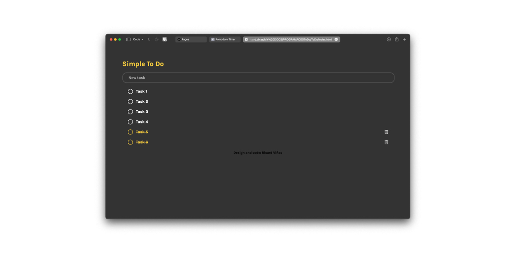

<h1 align="center"><a href="https://vinasricard.github.io/PomodoroTimer/" target="blank">To Do List Web App</a></h1>

<h3 align="center">This is a very simple tasks management web app that allows the user to create new tasks, mark them as completed and delete them; As easy as it sounds!</h3>
<h3 align="center">Built with HTML, CSS and JavaScript</h3>
 

